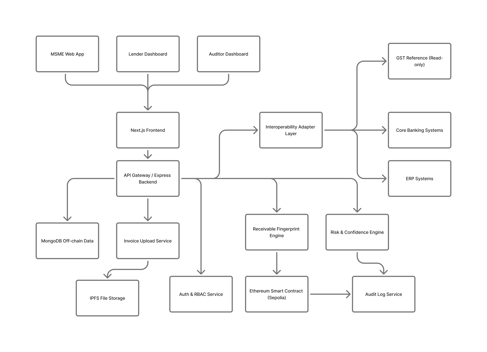
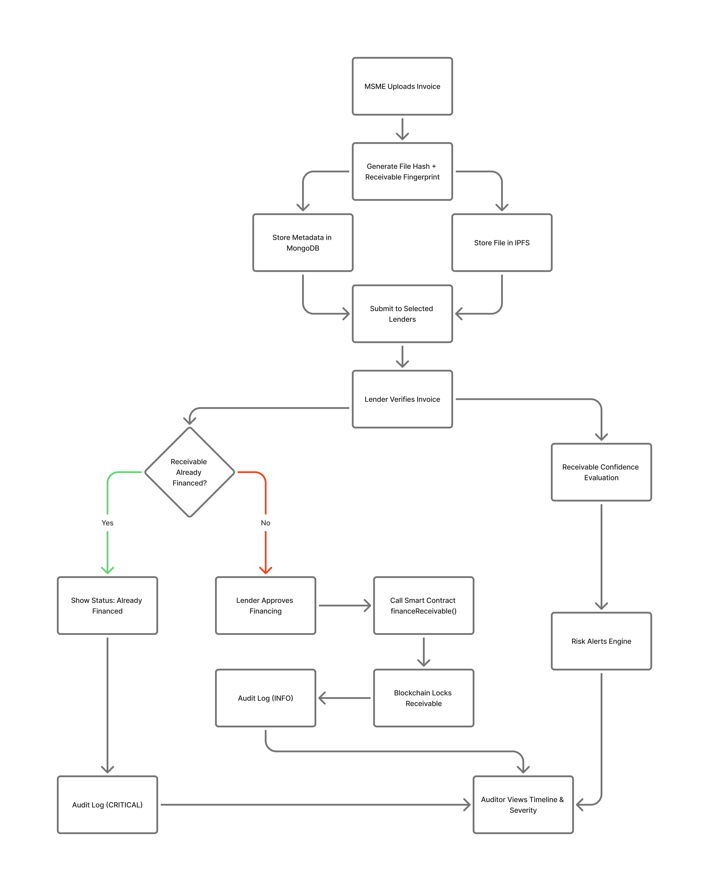

# OpenFlow — Blockchain-Powered Invoice Financing Platform

[](./LICENSE)

OpenFlow is a production-grade fintech platform that enables MSMEs to upload invoices, register them on the Ethereum Sepolia blockchain, store documents on IPFS, and obtain financing from verified lenders — all with a cryptographically-linked, tamper-proof audit trail.

> **UI Principle**: *OneFlow surfaces trust signals without interfering with lending decisions.*

---

## Table of Contents

- [Overview](#overview)
- [Architecture](#architecture)
- [Tech Stack](#tech-stack)
- [Project Structure](#project-structure)
- [Features](#features)
  - [Invoice Lifecycle](#invoice-lifecycle)
  - [Blockchain Integration](#blockchain-integration)
  - [IPFS / Pinata Storage](#ipfs--pinata-storage)
  - [Cross-Lender Privacy Model](#cross-lender-privacy-model)
  - [Interoperability Adapter Layer](#interoperability-adapter-layer)
  - [Audit Severity Levels](#audit-severity-levels)
  - [Receivable Confidence Levels](#receivable-confidence-levels)
  - [Soft Risk Alerts](#soft-risk-alerts)
  - [Role-Based Access Control](#role-based-access-control-rbac)
  - [Frontend Dashboards](#frontend-dashboards)
- [Shared UI Components](#shared-ui-components)
- [Smart Contract](#smart-contract)
- [Getting Started](#getting-started)
  - [Prerequisites](#prerequisites)
  - [Backend Setup](#backend-setup)
  - [Frontend Setup](#frontend-setup)
- [Environment Variables](#environment-variables)
- [API Reference](#api-reference)
- [User Roles](#user-roles)
- [Security](#security)
- [Contributing](#contributing)
- [License](#license)

---

## Overview

OpenFlow solves the invoice financing gap for small and medium enterprises (MSMEs) by:

1. Letting an **MSME** upload a PDF invoice — the backend hashes it (SHA-256), pins it to **IPFS** (Pinata), and registers the hash on a **Solidity smart contract** deployed on Ethereum Sepolia.
2. Letting a **Lender** verify the on-chain status of an invoice and finance it — triggering a blockchain transaction that prevents double-financing.
3. Giving an **Auditor** a full, immutable, paginated audit log of every action taken on every invoice.

The frontend is a Next.js 14 app with role-based dashboards for each participant.

---

## Architecture


<p align="center">
  
</p>

---

## Tech Stack

### Backend
| Layer | Technology |
|---|---|
| Runtime | Node.js |
| Framework | Express 5 |
| Database | MongoDB + Mongoose 9 |
| Auth | JWT (`jsonwebtoken`) + `bcryptjs` |
| Blockchain | `ethers` v6, Ethereum Sepolia |
| Storage | IPFS via Pinata (`axios` multipart) |
| Validation | `express-validator` |
| Security | `helmet`, `cors`, `express-rate-limit` |
| Logging | `morgan` |
| File Upload | `multer` (10 MB PDF limit) |

### Frontend
| Layer | Technology |
|---|---|
| Framework | Next.js 14 (App Router) |
| Language | TypeScript 5 |
| Styling | Tailwind CSS 3 + custom design tokens |
| Animation | Framer Motion 11, GSAP 3 |
| 3D | Three.js + `@react-three/fiber` + `@react-three/drei` |
| UI Components | Radix UI (Dialog, Dropdown) |
| Icons | Lucide React |
| Notifications | Sonner |
| Web3 | `ethers` v6 |
| HTTP Client | Axios |

### Smart Contract
| Layer | Technology |
|---|---|
| Language | Solidity ^0.8.20 |
| Network | Ethereum Sepolia Testnet |
| Contract | `InvoiceRegistry.sol` |

---

## Project Structure

```
OpenFlow/
├── backend/                        # Express API server
│   ├── server.js                   # Entry point (connects DB, starts server)
│   ├── package.json
│   ├── .env.example                # Environment variable template
│   ├── contracts/
│   │   └── InvoiceRegistry.sol     # Solidity smart contract
│   └── src/
│       ├── app.js                  # Express app, middleware, routes
│       ├── adapters/               # Interoperability adapter layer
│       │   ├── banking.adapter.js  # Core Banking (Finacle / Temenos) adapter
│       │   ├── erp.adapter.js      # ERP (SAP / Oracle / Tally) adapter
│       │   └── gst.adapter.js      # GST / NIC e-invoice validation adapter
│       ├── config/
│       │   └── db.js               # Mongoose connection
│       ├── controllers/
│       │   ├── auth.controller.js
│       │   ├── invoice.controller.js
│       │   ├── lender.controller.js
│       │   ├── audit.controller.js
│       │   ├── assurance.controller.js  # Assurance report management
│       │   ├── blockchain.controller.js
│       │   ├── health.controller.js
│       │   ├── docs.controller.js
│       │   ├── timeline.controller.js   # Invoice event timeline
│       │   └── msmeProfileController.js
│       ├── middleware/
│       │   ├── auth.js             # JWT verification
│       │   ├── rbac.js             # Role-based access control
│       │   ├── auditLogger.js      # Auto-logs every state transition
│       │   ├── validate.js         # express-validator error handler
│       │   ├── rateLimiter.js
│       │   ├── requestId.js        # Injects X-Request-ID header
│       │   └── errorHandler.js     # Global error handler
│       ├── models/
│       │   ├── User.js             # Roles: msme | lender | auditor
│       │   ├── Invoice.js          # Invoice lifecycle model
│       │   ├── MSMEProfile.js      # Extended MSME profile
│       │   ├── AuditLog.js         # Immutable audit entries
│       │   ├── AssuranceReport.js  # Assurance / due-diligence reports
│       │   ├── LenderSubmission.js # Per-lender submission state tracking
│       │   ├── Receivable.js       # Receivable fingerprint & deduplication
│       │   └── RiskAlert.js        # Soft risk signal records
│       ├── routes/
│       │   ├── v1.routes.js        # Versioned /api/v1 router
│       │   ├── auth.routes.js
│       │   ├── invoice.routes.js
│       │   ├── lender.routes.js
│       │   ├── audit.routes.js
│       │   ├── trust.routes.js     # Trust score & assurance endpoints
│       │   ├── blockchain.routes.js
│       │   ├── health.routes.js
│       │   ├── docs.routes.js
│       │   └── msmeProfileRoutes.js
│       ├── services/
│       │   ├── blockchain.service.js    # ethers.js — register/finance on-chain
│       │   ├── ipfs.service.js          # Pinata IPFS upload
│       │   ├── audit.service.js         # Audit log creation helpers
│       │   ├── trust.service.js         # Trust score computation
│       │   ├── intelligence.service.js  # Risk signal & confidence scoring
│       │   └── eventListener.service.js # Blockchain event listener
│       ├── validators/
│       │   ├── auth.validator.js
│       │   └── invoice.validator.js
│       └── utils/
│           ├── AppError.js         # Custom error class
│           ├── hash.js             # SHA-256 file hashing
│           └── response.js         # Standardised JSON response helpers
│
├── frontend/                       # Next.js 14 app
│   ├── package.json
│   ├── tailwind.config.ts
│   ├── tsconfig.json
│   └── src/
│       ├── middleware.ts           # Auth guard (redirects by role)
│       ├── app/
│       │   ├── page.tsx            # Public landing page
│       │   ├── layout.tsx          # Root layout (AuthProvider)
│       │   ├── about/              # Architecture & interoperability page
│       │   ├── (auth)/
│       │   │   ├── login/
│       │   │   └── register/
│       │   └── (dashboard)/
│       │       ├── msme/           # Upload, history, pending, financed, fraud-alert
│       │       ├── lender/         # Verify, finance, trust signals, privacy
│       │       └── auditor/        # Audit trail, severity filter, system health
│       ├── components/
│       │   ├── oneflow/            # Domain-specific components
│       │   │   ├── HashVerifier.tsx         # On-chain invoice verification
│       │   │   ├── InvoiceUploader.tsx
│       │   │   ├── BlockchainVisualizer.tsx
│       │   │   └── ...
│       │   └── shared/             # Reusable UI components
│       │       ├── StatusBadge.tsx          # Invoice status pill
│       │       ├── AuditSeverityBadge.tsx   # INFO / WARNING / CRITICAL badge
│       │       ├── ConfidenceBadge.tsx      # HIGH / MEDIUM / LOW confidence
│       │       ├── RiskFlagBadge.tsx        # Soft risk alert label
│       │       ├── InteroperabilityBadge.tsx # Trust layer verification label
│       │       ├── TrustScoreCard.tsx
│       │       ├── InvoiceTimeline.tsx
│       │       ├── AssuranceReportViewer.tsx
│       │       └── ...
│       ├── context/
│       │   └── AuthContext.tsx     # JWT session, role, demo-mode state
│       ├── hooks/
│       │   └── useWallet.ts        # MetaMask / ethers wallet hook
│       └── lib/
│           ├── api.ts              # API client (authAPI, invoiceAPI, lenderAPI…)
│           ├── utils.ts
│           └── mock/               # Demo-mode mock data
│

```

---

## Features

### Invoice Lifecycle

<p align="center">
  
</p>

- **Upload** — MSME uploads a PDF (≤ 10 MB). Backend computes a SHA-256 hash, uploads to IPFS via Pinata, and registers the hash on-chain via `InvoiceRegistry.registerInvoice()`.
- **Submit to Lender** — MSME selects a lender; the backend creates a `LenderSubmission` record and transitions invoice status to `SUBMITTED`.
- **Verify** — Lender queries MongoDB and the blockchain to confirm an invoice is registered and not yet financed.
- **Finance** — Lender calls `InvoiceRegistry.financeInvoice()`. The contract guards against double-financing; status updates to `FINANCED`.
- **Audit** — Every state transition writes an immutable entry to `AuditLog` via `auditLogger` middleware. Auditors can filter by severity, action, user, or invoice.

### Blockchain Integration
- Hash-only approach — no sensitive data on-chain, only `bytes32` hashes and flags.
- `InvoiceRegistry` supports a **Receivable Fingerprint** pattern for cross-lender deduplication.
- Duplicate financing attempts emit a `DuplicateFinancingAttempt` event rather than reverting silently.
- Lender wallet addresses must be explicitly authorised by the contract owner via `authorizeLender()`.

### IPFS / Pinata Storage
- Invoice PDFs are pinned to IPFS on upload; CID stored in MongoDB (`ipfsCID`).
- Files are always retrievable via the Pinata gateway using the stored CID.
- IPFS upload is optional — if credentials are absent the invoice is still hashed and stored in MongoDB.

### Cross-Lender Privacy Model
The frontend enforces strict privacy rules on financed invoices:
- **Lender Dashboard / Details** — Finance button is hidden; lender identity, amount, and timestamp are masked. A lock notice reads: *"This receivable has already been financed — cross-lender privacy rules apply."*
- **MSME Dashboard** — Financed invoices display *"Financed by a lender"* — no lender name is ever exposed.
- **Auditor Dashboard** — Full event type, severity, and timestamp visible (permissible for regulators). No lender-to-lender data leakage.

### Interoperability Adapter Layer
Backend adapters connect OneFlow to existing enterprise infrastructure as read-only integration points:

| Adapter | Description |
|---|---|
| `erp.adapter.js` | SAP / Oracle / Tally-compatible invoice ingestion |
| `banking.adapter.js` | CBS APIs (Finacle, Temenos, BankingCloud) for disbursement & reconciliation |
| `gst.adapter.js` | GSTIN / NIC e-invoice portal validation before on-chain anchoring |

Frontend surfaces this via a read-only **"Verified via OneFlow Trust Layer (ERP & Core Banking compatible)"** badge on the Lender Dashboard, HashVerifier result, Auditor Dashboard header, and About / Architecture page.

### Audit Severity Levels
Every audit log entry is colour-coded by severity in the Auditor Dashboard:

| Severity | Colour | Trigger Examples |
|---|---|---|
| `INFO` | Blue / Grey | Login, invoice registered, profile updated |
| `WARNING` | Orange | Suspicious submission, verification alert |
| `CRITICAL` | Red | Duplicate financing attempt, invoice blocked |

A severity filter dropdown (`ALL / CRITICAL / WARNING / INFO`) lets auditors slice the live timeline.

### Receivable Confidence Levels
A non-blocking **Confidence Badge** is shown to lenders on verification results and invoice detail pages:

| Confidence | Colour | Meaning |
|---|---|---|
| `HIGH` | Green | Consistent receivable data across submissions |
| `MEDIUM` | Yellow | Manually entered data, not yet corroborated |
| `LOW` | Red | Inconsistent or risky data patterns detected |

No numeric scores or internal signals are exposed. The badge never blocks any lending action.

### Soft Risk Alerts
A non-blocking **⚠ Risk Flag Badge** (orange) appears when the backend returns a `riskFlag` value:
- **Lender view** — Label only (e.g. *"⚠ Needs Review"*). Hover tooltip: *"The system has detected behavioral patterns that may require manual review."* No reason codes, no cross-lender leakage.
- **Auditor view** — Risk events appear as timeline items with severity badge and timestamp.
- **MSME view** — `SUBMITTED` invoices show a neutral *"Verification in progress with lenders"* label. No risk signals are exposed.

### Role-Based Access Control (RBAC)
| Resource | MSME | Lender | Auditor |
|---|:---:|:---:|:---:|
| Upload invoice | ✅ | — | — |
| Submit to lender | ✅ | — | — |
| View own invoices | ✅ | — | — |
| View all invoices | — | ✅ | ✅ |
| Verify invoice | — | ✅ | — |
| Finance invoice | — | ✅ | — |
| View audit logs | — | — | ✅ |
| View risk signals | — | ✅ (limited) | ✅ (full) |
| View trust score | ✅ | ✅ | — |

### Frontend Dashboards
- **MSME**: Upload invoices, submit to lenders, track history across pending / financed / rejected / fraud-alert tabs, manage extended profile. Financed invoices respect cross-lender privacy.
- **Lender**: Hash Verifier with on-chain lookup, `ConfidenceBadge` + `RiskFlagBadge` on results, finance eligible invoices, loan history, active loans, disbursement panel, fraud reporting, and verify-hash page.
- **Auditor**: Live audit trail with `AuditSeverityBadge` colour-coding + severity filter dropdown, system health panel (Oracle Consensus, zkProof, IPFS, Smart Contract), read-only invoice list.
- **Demo Mode**: Full interactive walkthrough without a backend connection (mock data).

---

## Shared UI Components

| Component | Purpose |
|---|---|
| `StatusBadge` | Invoice status pill (`UPLOADED / SUBMITTED / VERIFIED / FINANCED / BLOCKED / FRAUD_ALERT`) |
| `AuditSeverityBadge` | Colour-coded severity label for audit events (`INFO / WARNING / CRITICAL`) |
| `ConfidenceBadge` | Receivable confidence level with hover tooltip (`HIGH / MEDIUM / LOW`) |
| `RiskFlagBadge` | Non-blocking soft risk alert label; hidden when `riskFlag` is `CLEAR` / `NONE` |
| `InteroperabilityBadge` | Static "Verified via OneFlow Trust Layer" label for judges / reviewers |
| `TrustScoreCard` | MSME trust score visualisation with optional detailed breakdown |
| `InvoiceTimeline` | Per-invoice event timeline pulled from audit logs |
| `AssuranceReportViewer` | Displays assurance / due-diligence reports; supports acknowledgement |
| `HashVerifier` | Full ledger oracle — accepts Invoice ID, SHA-256 hash, or IPFS CID |

---

## Smart Contract

**File**: [backend/contracts/InvoiceRegistry.sol](backend/contracts/InvoiceRegistry.sol)  
**Network**: Ethereum Sepolia Testnet  
**Address**: configured via `INVOICE_REGISTRY_CONTRACT` env var

### Key Functions
| Function | Access | Description |
|---|---|---|
| `registerInvoice(bytes32, string)` | Owner / Backend wallet | Register an invoice hash |
| `financeInvoice(bytes32)` | Authorized lenders | Mark an invoice as financed |
| `registerReceivable(bytes32)` | Owner | Register a receivable fingerprint |
| `financeReceivable(bytes32)` | Authorized lenders | Finance a receivable |
| `isRegistered(bytes32)` | Public | Check if an invoice is registered |
| `isFinanced(bytes32)` | Public | Check if an invoice is financed |
| `authorizeLender(address)` | Owner | Grant lender permissions |
| `revokeLender(address)` | Owner | Revoke lender permissions |

### Events
- `InvoiceRegistered(bytes32, string, address, uint256)`
- `InvoiceFinanced(bytes32, address, uint256)`
- `DuplicateFinancingAttempt(bytes32, address, uint256)`
- `ReceivableRegistered(bytes32)`
- `ReceivableFinanced(bytes32, address)`
- `LenderAuthorized(address)` / `LenderRevoked(address)`

---

## Getting Started

### Prerequisites

- **Node.js** v18+ and **npm** v9+
- **MongoDB** (local or Atlas)
- **Ethereum Sepolia** RPC endpoint (Alchemy / Infura)
- **Pinata** account for IPFS (optional but recommended)
- A funded Sepolia wallet (for deploying / calling the contract)

---

### Backend Setup

```bash
cd backend

# 1. Install dependencies
npm install

# 2. Configure environment
cp .env.example .env
# Edit .env — see Environment Variables section below

# 3. (Optional) Seed the database with demo users
npm run seed

# 4. Start development server (auto-reload via --watch)
npm run dev

# 5. Start production server
npm start
```

Server runs on `http://localhost:5000` by default.

---

### Frontend Setup

```bash
cd frontend

# 1. Install dependencies
npm install

# 2. Configure environment
# Create .env.local and set NEXT_PUBLIC_API_URL
echo "NEXT_PUBLIC_API_URL=http://localhost:5000" > .env.local

# 3. Start development server
npm run dev

# 4. Build for production
npm run build && npm start
```

Frontend runs on `http://localhost:3000` by default.

---

## Environment Variables

### Backend (`backend/.env`)

```dotenv
# Server
PORT=5000
NODE_ENV=development

# MongoDB
MONGO_URI=mongodb://localhost:27017/fintrust
# or Atlas: mongodb+srv://<user>:<password>@cluster.mongodb.net/fintrust

# JWT
JWT_SECRET=change_this_to_a_long_random_secret
JWT_EXPIRES_IN=24h

# Ethereum Sepolia
SEPOLIA_RPC_URL=https://eth-sepolia.g.alchemy.com/v2/YOUR_ALCHEMY_KEY
WALLET_PRIVATE_KEY=your_wallet_private_key_without_0x_prefix
INVOICE_REGISTRY_CONTRACT=0xYourDeployedContractAddress

# Blockchain event listeners (set false on free-tier RPC to avoid rate limits)
ENABLE_EVENT_LISTENERS=false

# IPFS — Pinata (optional)
PINATA_API_KEY=your_pinata_api_key
PINATA_SECRET_KEY=your_pinata_secret_key

# Rate Limiting (defaults: 15 min window, 100 requests)
RATE_LIMIT_WINDOW_MS=900000
RATE_LIMIT_MAX=100
```

> **Note**: Blockchain and IPFS credentials are optional. Their respective services degrade gracefully and log a warning if not configured.

### Frontend (`frontend/.env.local`)

```dotenv
NEXT_PUBLIC_API_URL=http://localhost:5000
```

---

## API Reference

All versioned routes are prefixed with `/api/v1`. Legacy routes (without version prefix) are kept for backward compatibility.

### Health

| Method | Endpoint | Description |
|---|---|---|
| `GET` | `/api/v1/health` | Server and DB health check |

### Authentication (`/api/v1/auth`)

| Method | Endpoint | Auth | Description |
|---|---|---|---|
| `POST` | `/api/v1/auth/register` | — | Register a new user |
| `POST` | `/api/v1/auth/login` | — | Login — returns JWT |
| `GET` | `/api/v1/auth/me` | Bearer | Get current user profile |
| `PATCH` | `/api/v1/auth/me` | Bearer | Update name / organization |

**Register body:**
```json
{
  "name": "MSME Corp",
  "email": "msme@example.com",
  "password": "securePass1",
  "role": "msme",
  "organization": "MSME Corp Pvt Ltd"
}
```
Roles: `msme` · `lender` · `auditor`

### Invoices (`/api/v1/invoices`)

| Method | Endpoint | Auth | Role | Description |
|---|---|---|---|---|
| `POST` | `/api/v1/invoices` | Bearer | MSME | Upload invoice PDF |
| `GET` | `/api/v1/invoices` | Bearer | All | List invoices (paginated) |
| `GET` | `/api/v1/invoices/:id` | Bearer | All | Get invoice details |

`POST` uses `multipart/form-data`:
- `file` — PDF, max 10 MB
- `invoiceNumber` — e.g. `INV-2026-001`
- `amount` — numeric
- `currency` — optional, default `INR`
- `description` — optional, max 500 chars

Query params for list: `page`, `limit`, `status` (`UPLOADED | FINANCED | BLOCKED`)

### Lender (`/api/v1/lender`)

| Method | Endpoint | Auth | Role | Description |
|---|---|---|---|---|
| `GET` | `/api/v1/lender/verify/:invoiceId` | Bearer | Lender | Verify invoice (DB + chain) |
| `POST` | `/api/v1/lender/finance/:invoiceId` | Bearer | Lender | Finance an invoice |

### Audit Logs (`/api/v1/audit`)

| Method | Endpoint | Auth | Role | Description |
|---|---|---|---|---|
| `GET` | `/api/v1/audit/logs` | Bearer | Auditor | All audit logs (paginated) |
| `GET` | `/api/v1/audit/logs/:invoiceId` | Bearer | Auditor | Logs for a specific invoice |

Query params: `page`, `limit`, `action`, `userId`

### Blockchain (`/api/v1/blockchain`)

| Method | Endpoint | Auth | Description |
|---|---|---|---|
| `GET` | `/api/v1/blockchain/status/:invoiceHash` | Bearer | On-chain registration status |
| `POST` | `/api/v1/blockchain/register` | Bearer | Manually register a hash |

### MSME Profile (`/api/msme-profile`)

| Method | Endpoint | Auth | Role | Description |
|---|---|---|---|---|
| `GET` | `/api/msme-profile` | Bearer | MSME | Get own profile |
| `PUT` | `/api/msme-profile` | Bearer | MSME | Create / update profile |

---

## User Roles

| Role | Description |
|---|---|
| **MSME** | Small / medium enterprise that uploads invoices for financing. Has access to the MSME dashboard: upload, history, pending, financed, and profile views. |
| **Lender** | Financial institution that verifies and finances invoices. Must be authorised on-chain by the contract owner. |
| **Auditor** | Read-only role with access to the full audit log across all invoices and users. Intended for regulators / compliance officers. |

---

## Security

| Control | Implementation |
|---|---|
| Password hashing | `bcryptjs` with salt rounds = 12 |
| JWT | HS256, configurable expiry (default 24 h) |
| RBAC | `rbac.js` middleware enforces role on every protected route |
| Rate limiting | `express-rate-limit` — 100 req / 15 min per IP (configurable) |
| HTTP headers | `helmet` sets secure defaults (CSP, HSTS, X-Frame-Options, etc.) |
| Request tracing | `requestId.js` injects `X-Request-ID` on every response |
| Input validation | `express-validator` schemas for auth and invoice routes |
| File validation | `multer` — PDF only, 10 MB hard limit |
| On-chain integrity | SHA-256 hash stored on-chain; any tampering is immediately detectable |
| IPFS pinning | Files pinned permanently; CID is the content address — immutable by design |

---

## Contributing

1. Fork the repository and create a feature branch from `main`.
2. Follow the existing code style (CommonJS for backend, TypeScript strict mode for frontend).
3. Write clear commit messages.
4. Open a pull request with a description of the changes and any relevant test output.

---

## License

This project is licensed under the **Apache License 2.0**.
See the [LICENSE](./LICENSE) file for the full license text.

---

> Built for the Indian MSME ecosystem with RBI / SEBI compliance principles in mind.  
> Powered by Ethereum · IPFS · MongoDB · Next.js.
